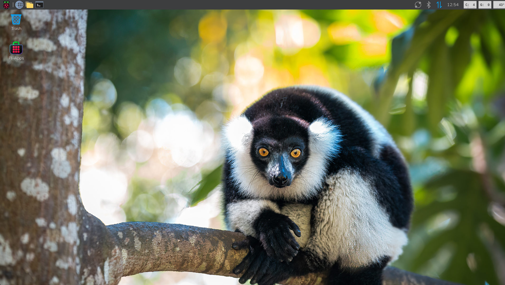

# **🍓 Bing Wallpaper for Raspberry Pi**

 


**Auto-magically set the "Bing Wallpaper of the Day" as your Raspberry Pi desktop background.**

## **🚀 Quick Install (One-Liner)**

Open your terminal and run the following command to install the script automatically:  

```bash
wget -qO- https://raw.githubusercontent.com/ventura8/Raspberry-Pi-OS-Bing-Wallpaper-Auto-update/main/install.sh | bash
```

## **📸 Screenshots**

 
Beautiful daily landscapes on your Raspberry Pi desktop

## **✨ Features**

* **Automated Installer:** 🛠️ Get up and running with a single command.  
* **Daily Updates:** 📅 Automatically fetches the latest image from Bing's daily archive.
* **Modern Desktop Support:** 🖥️ Works on **Raspberry Pi OS** (Labwc/Wayfire) and **Xubuntu** (XFCE).
* **4K Support:** 🎥 Option to download Ultra HD (4K) wallpapers where available.
* **Region Support:** 🌍 Configurable region/market (e.g., Global, US, Japan) to get specific wallpapers.  
* **Storage Management:** 💾 Smart handling of disk space—choose to keep a history of all wallpapers or only the latest one.
* **Smart Naming:** 🏷️ Saves files as `YYYY-MM-DD - Title - Copyright.jpg` for easy organizing.
* **Lightweight:** 🪶 Uses standard tools (`curl`, `sed`, `grep`) and native `pcmanfm` integration.
* **Robust Logging:** 📝 Detailed logs with timestamps, image titles, and copyright info.
* **Cron Ready:** ✅ Optimized for scheduled runs with built-in environment handling.

## **📋 Prerequisites**

> [!IMPORTANT]
> This script is optimized for **Raspberry Pi OS** (Bookworm and Trixie) and **Xubuntu** (XFCE). It automatically detects your desktop environment.

**Required Tools:**

* `curl` (Usually pre-installed)  
* `pcmanfm` (Raspberry Pi OS) OR `xfconf-query` (Xubuntu)

## **🚀 Installation**

1. Download the script:  
   Save the `bing\wallpaper.sh` file to a directory of your choice (e.g., `~/scripts/`).  
2. **Make it executable:**
   
   ```bash
   mkdir -p ~/scripts  
   # Move the file if you haven't already  
   mv bing_wallpaper.sh ~/scripts/  
   chmod +x ~/scripts/bing_wallpaper.sh
   ```

> [!TIP]
> **Interactive Installer:**
> The installer will ask you for:
> 1. **Bing Region** (e.g., `en-US`, `ja-JP`, or default `en-WW`).
> 2. **Update Schedule** (Default is 10:00 AM daily).


## **🎮 Usage**

Run the script manually to test it: 

```bash
~/scripts/bing_wallpaper.sh
```

## **⚙️ Configuration**

> [!TIP]
> You can re-run the installer at any time to change the **Region** or **Schedule** interactively!

Open `bing_wallpaper.sh` in a text editor (like `nano`) to tweak the settings at the top of the file:

### **1\. Change Region**

Modify the `REGION` variable to change the source of the wallpaper.

```bash
# Options: en-US, en-GB, ja-JP, de-DE, en-WW (Global), etc.  
REGION="en-WW"
```

Supported Region Codes:
| Code | Region | Code | Region |
| :--- | :--- | :--- | :--- |
| en-WW | Worldwide | en-IN | India |
| en-US | USA | it-IT | Italy |
| en-AU | Australia | ja-JP | Japan |
| pt-BR | Brazil | en-NZ | New Zealand |
| en-CA | Canada | es-ES | Spain |
| zh-CN | China | en-GB | England (UK) |
| fr-FR | France | en-SG | Singapore |
| de-DE | Germany | | |

### **2\. Resolution (4K vs 1080p)**

Set the desired quality.

```bash
# Options: "1080p" (default) or "4k"
RESOLUTION="1080p"
```

### **3\. Keep History**

By default, the script deletes old wallpapers to save space. To keep them, change `KEEP_OLD` to `"true"`.

```bash
KEEP_OLD="true"
``` 

## **⏰ Automation (Daily Updates)**

The installer automatically sets up the schedule for you (Default: 10:00 AM).

### **🕒 Changing the Schedule**

To change the time, simply run the installer again.
It will detect your existing installation and ask if you want to set a custom time.

Alternatively, advanced users can edit the schedule manually:

1. Run crontab -e
2. Edit the numbers at the start of the line: Minute Hour ...

> [!NOTE]  
> Adjust `/home/pi/scripts/` in the command above to match the actual location where you saved the script.

## **🛠️ Development & Testing**

### **Code Quality**
- **Linting:** ShellCheck is used for all shell scripts.
- **Testing:** BATS (Bash Automated Testing System) is used for testing.

### **Testing & Coverage**
The project maintains a **mandatory minimum of 90% code coverage**. CI will fail if coverage drops below this threshold.

Local test runs automatically update the coverage badge. **You must run tests locally and commit the updated badge before pushing changes.**

To run tests locally (requires Docker):
```powershell
./run_tests_local.ps1
```

Coverage reports are generated in the `coverage/` directory, and the badge is updated at `assets/coverage.svg`.

## **🗑️ Uninstallation**

If you want to remove the script and the automated schedule, you can use the one-line uninstaller:

```bash
curl -sSL https://raw.githubusercontent.com/ventura8/Raspberry-Pi-OS-Bing-Wallpaper-Auto-update/main/uninstall.sh | bash
```

This will:
1. Remove `bing_wallpaper.sh` and logs from your scripts directory.
2. Remove the cron job entry.
3. Remove the scripts directory if it's empty.

## **🔧 Troubleshooting**

> [!TIP]  
> Cron Issues:  
> If the wallpaper doesn't update automatically via cron, double-check that your script is executable (`chmod \+x`) and that you used absolute paths (e.g., `/home/pi/scripts/...`) in the crontab line.

> [!CAUTION]
> **"Desktop manager is not active"** Error:
> The script automatically sets `XDG_RUNTIME_DIR`. If you still see this, ensure your user is logged into the desktop session when the script runs.

> [!NOTE]
> Manual Overrides:
> If you are using a non-standard setup and the wallpaper doesn't change, ensure your `$USER` matches the one logged into the desktop. The script uses export `DISPLAY=:0` by default.
